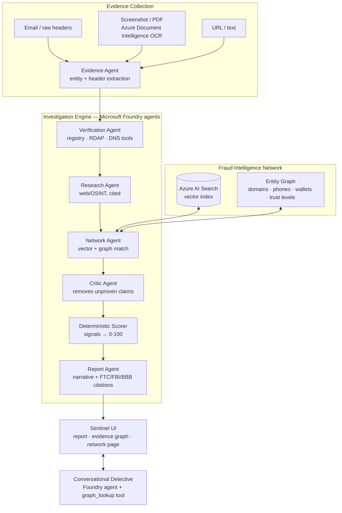

# Demo Script — Verify My Interview

Judging weights: **20% Accuracy/Relevance · 20% Reasoning & multi-step agent collaboration · 15% Creativity · 15% UX · 20% Reliability & Safety · 10% Community.** Required artifacts: public GitHub repo, ≤5-min video, architecture diagram. Microsoft Foundry must be visibly central.

## The one-line pitch

"Most job scams don't look like scams — the fraud hides in the relationships between evidence. Verify My Interview is a multi-agent fraud-intelligence platform that proves what it claims."

## Demo case (the "ring reveal")

Paste the seeded sample (frontend `lib/samples.ts`): a professional-looking offer email impersonating a known brand, referencing ring domain `nimbustalent-careers.net` and the ring's USDT wallet. Nothing about the verdict is hardcoded — the match is computed live against the seeded "Nimbus Talent" ring (6 prior reports, different brand names, shared wallet/phone/domains).

Expected outcome: **Likely Scam (≥71)**, network signal citing corroborated prior reports, case subgraph showing the email → domain → wallet → 6 reports → other brand names.

## Video shot list (≤5:00)

| Time | Beat | Criterion served |
|---|---|---|
| 0:00–0:40 | Problem: show the demo email — "would you spot it?" It has a real brand, professional tone. | Creativity, Community |
| 0:40–1:50 | Paste into New Case → **6-agent timeline animates**: Evidence → Verification → Research → Network → Critic → Report, each with engine badge (foundry), tool calls, findings, durations. Narrate the collaboration explicitly. | Reasoning 20% |
| 1:50–2:30 | Verdict card + signals: every red flag shows claim + evidence + confidence + source; guidance citations (FTC/FBI/BBB). Mention the Critic removed unsupported claims. | Accuracy 20%, Safety |
| 2:30–3:30 | **The ring reveal:** click the evidence graph — domain node → wallet node → 6 prior reports impersonating *different* companies. "They rotate brand names; they reuse infrastructure." Jump to /network full graph + threat stats. | Creativity 15%, UX 15% |
| 3:30–4:10 | Detective chat: "Is this wallet linked to other scams?" (graph_lookup fires) → "Draft a reply to this recruiter" (safe probing email). | Reasoning, UX |
| 4:10–4:45 | Reliability: show `GET /health` subsystem flags; rerun the same case with Azure env disabled → deterministic fallback completes; show `npm run eval` pass table. | Reliability & Safety 20% |
| 4:45–5:00 | Architecture diagram with Foundry components highlighted; repo link. | Accuracy/Relevance |

Recording notes: 1080p+, dark OS theme, hide bookmarks bar, no emoji reactions, rehearse the graph click so the ring is framed. Pre-warm the server (first Foundry call is slow).

## Safety framing (say this, and keep it true in the UI)

- "Risk assessment, not accusation" — the platform reports evidence-backed risk, never definitively labels a real organization a scam.
- All network data in the demo is **synthetic** (banner on /network says so).
- Evidence is treated as untrusted input; no PII in logs; reports carry trust levels to resist poisoning.

## Architecture diagram (Mermaid source — keep in docs/ARCHITECTURE.md and README)

## Cut order if time runs out (never cut the bolded)

Foundry IQ KB → extra eval cases → SSE streaming → **graph UI, 6-stage timeline, deterministic fallback, demo video**.

## Submission checklist

- [ ] Public repo, `.env` excluded, README with diagram + eval table + setup
- [ ] ≤5-min video uploaded, link in submission
- [ ] Architecture diagram renders on GitHub
- [ ] Live demo works with AND without Azure env (insurance run rehearsed)
- [ ] Submission form done before 2026-06-14 23:59 PT
