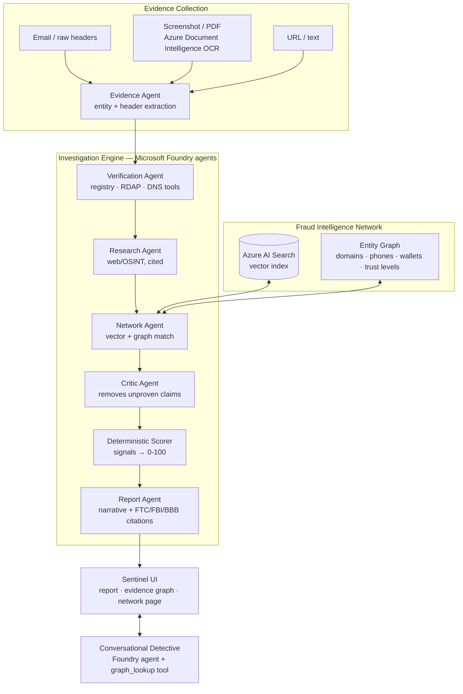

# Verify My Interview

A fraud-intelligence platform for job seekers, built on **Microsoft Foundry**.

Most modern job scams don't look like scams: real company names, professional
emails, polished offer letters. The fraud hides in the **relationships between
pieces of evidence** — a "Google recruiter" whose domain was registered last
month, a Reply-To that routes to a free mailbox, a USDT wallet that six prior
victims reported under six different brand names.

So instead of asking *"does this email look suspicious?"*, Verify My Interview
asks *"what can we prove about this recruiter, company, domain, phone number,
and payment trail?"* — and shows the proof.

## Four systems

1. **Evidence Collection** — paste an email (raw headers understood:
   Reply-To mismatch, sender IP, SPF/DKIM/DMARC), upload a screenshot or PDF
   (Azure AI Document Intelligence OCR), or drop a URL.
2. **Investigation Engine** — six specialist Foundry agents collaborate:
   Evidence → Verification → Research → Network → Critic → Report. Every
   finding is `claim + evidence + confidence + source`; the Critic strikes
   anything no tool result proves.
3. **Fraud Intelligence Network** — reports live in an Azure AI Search vector
   index and an entity graph over hard identifiers (domains, emails, phones,
   payment handles — never names). Reports that share infrastructure are
   promoted to `corroborated`; network signals are trust-weighted to resist
   poisoning.
4. **Conversational Detective** — interrogate the verdict, look identifiers up
   in the graph, launch deeper checks, or have it draft a safe reply to the
   recruiter.

## Architecture



Details: [docs/ARCHITECTURE.md](docs/ARCHITECTURE.md)

## What makes it different

- **The evidence graph.** The report page renders the case's identifiers
  connected to prior reports. In the demo corpus, one wallet links six reports
  impersonating six different companies — click any node and see the proof.
  Scammers rotate brand names; they reuse infrastructure.
- **Agents never set the score.** Reasoning plans the investigation; a
  transparent deterministic scorer sums evidence-backed signals into the
  0–100 risk score. Every point is traceable.
- **Cited guidance.** Verdicts attach the FTC / FBI IC3 / BBB guidance that
  matches the signals the case actually triggered, with real source URLs.
- **Always demoable.** Every agent has a deterministic fallback. Unset the
  Azure env vars and the same case still completes — the trace just says
  `deterministic` instead of `foundry`.

## Evals

`npm run eval` runs every scenario in `tests/test_cases/` through the full
pipeline in reproducible offline mode (external keys scrubbed) and asserts
risk-level band, score range, required/forbidden signals, and network-match
expectations. `npm test` gates the same suite in Jest. Current run:

| Case | Level | Score | Result |
|---|---|---|---|
| Ring-linked offer (shared scam infrastructure) | Likely Scam | 100 | PASS |
| Obvious scam (Google impersonation) | Likely Scam | 100 | PASS |
| Header-spoofed corporate email (SPF/DMARC fail) | Likely Scam | 67 | PASS |
| Suspicious — mixed signals | Suspicious | 55 | PASS |
| Legitimate job (Microsoft) | Low Risk | 0 | PASS |
| Insufficient evidence | Inconclusive | 0 | PASS |

These same evals caught real bugs during development — a brand-word
entity-resolution false positive ("gift card: Microsoft" linking every email
that mentioned Microsoft) and a zero-evidence case being nudged into
reassuring "Low Risk".

## Quick start (no Azure required)

```bash
npm install
npm run build        # backend tsc + frontend vite -> public/
npm start            # http://localhost:3000
```

Or for development: `npm run dev` (API) + `npm run dev:web` (Vite).

Try a case:

```bash
curl -X POST http://localhost:3000/analyze \
  -H "Content-Type: application/json" \
  -d '{"evidence":"From: d.okafor@nimbus-talent-hr.com\nReply-To: nimbus.onboarding@gmail.com\nSubject: Final onboarding - QA Analyst at Google\n\nA refundable compliance deposit of $200 is required, payable in USDT to wallet TQrKp4mNbu77 or Zelle: nimbus-onboard. Reach us on WhatsApp +1 (332) 555-0144."}'
```

Without Azure configured the pipeline runs deterministically and the network
is seeded in-memory — the response still includes the verdict, six-stage
trace, signals, and the case subgraph linking this wallet/domain/phone to the
seeded ring.

## Microsoft Foundry setup (full engine)

Auth is **Microsoft Entra ID** (`DefaultAzureCredential`) — no API keys in code.

1. Create a Foundry project and deploy a model (e.g. `gpt-4o`).
2. `az login`
3. Configure `.env` (see [.env.example](.env.example) for every subsystem):

```bash
AZURE_AI_PROJECT_ENDPOINT=https://<resource>.services.ai.azure.com/api/projects/<project>
AZURE_AI_MODEL_DEPLOYMENT=gpt-4o
# optional extras
AZURE_SEARCH_ENDPOINT=...        # semantic network matching
AZURE_SEARCH_API_KEY=...
AZURE_DOCINT_ENDPOINT=...        # OCR uploads
AZURE_DOCINT_KEY=...
SERPAPI_API_KEY=...              # Research agent web/OSINT
```

4. Seed the intelligence network index: `npm run seed:network`

Deployment to Azure Container Apps is covered by the
`.claude/skills/deploy-azure-foundry` skill.

## API

| Endpoint | Purpose |
|---|---|
| `POST /analyze` | Investigate evidence → report + trace + signals + case subgraph |
| `POST /chat` | Case-aware detective (tools: graph lookup, deeper checks, reply drafting) |
| `POST /upload` | OCR a screenshot/PDF via Document Intelligence |
| `POST /report` | Submit a report to the intelligence network |
| `GET /network/graph` | Full entity graph (`?type=&minTrust=`) |
| `GET /network/stats` | Threat statistics over the corpus |
| `GET /health` | Per-subsystem status flags |

## Safety

This is a **risk assessment** tool, not an accusation engine: it reports
evidence-backed risk with confidence and sources, and prefers "needs more
verification" over false alarms. All network data shipped in this repo is
synthetic demo data and is labeled as such in the UI. Evidence is treated as
untrusted input; sensitive details are not logged.

## Repo layout

```
src/backend/agent/        orchestrator + the six specialist agents (Foundry runner + fallbacks)
src/backend/tools/        verification tool adapters (registry, RDAP/DNS, patterns, web research)
src/backend/network/      AI Search corpus, entity graph, trust levels, seed data
src/backend/scorer/       signal engine + deterministic scorer
src/backend/knowledge/    FTC/FBI/BBB guidance matching
src/backend/ocr/          Azure Document Intelligence
src/backend/scripts/      seedNetwork, runEvals, smoke
frontend/                 React + Vite + Tailwind (Sentinel UI)
tests/test_cases/         eval scenarios (run: npm run eval)
docs/                     ARCHITECTURE, SPEC, TOOL_STRATEGY, REPORT_SCHEMA, ...
```

## License

MIT
