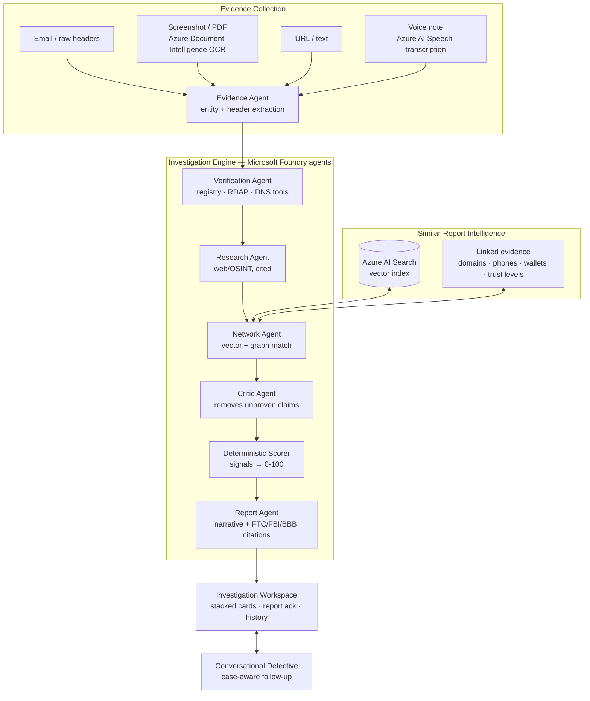

# Verify My Interview

A fraud-intelligence platform for job seekers, built on **Microsoft Foundry**.

Most modern job scams don't look like scams: real company names, professional
emails, polished offer letters. The fraud hides in the **relationships between
pieces of evidence** — a "Google recruiter" whose domain was registered last
month, a Reply-To that routes to a free mailbox, a USDT wallet that six prior
victims reported under six different brand names.

So instead of asking *"does this email look suspicious?"*, Verify My Interview
asks *"what can we prove about this recruiter, company, domain, phone number,
and payment trail?"* — and shows the proof.

## Four systems

1. **Evidence Collection** — paste an email (raw headers understood:
   Reply-To mismatch, sender IP, SPF/DKIM/DMARC), upload a screenshot or PDF
   (Azure AI Document Intelligence OCR), drop a URL, or **tell us what happened
   by voice** (Azure AI Speech transcription) — for scams that ran over WhatsApp
   calls or voice notes, where there's no email to forward.
2. **Investigation Engine** — six specialist Foundry agents collaborate:
   Evidence → Verification → Research → Network → Critic → Report. Every
   finding is `claim + evidence + confidence + source`; the Critic strikes
   anything no tool result proves.
3. **Similar-Report Intelligence** — de-identified reports live in Azure AI
   Search and a backend linked-evidence model over hard identifiers (domains,
   emails, phones, payment handles — never names). The UI keeps this simple:
   users see plain "Similar reports" cards only when a prior report is useful.
4. **Workspace + History** — the product is one ChatGPT-style investigation
   workspace, plus a simple browser-local history so users can re-check past
   evidence without understanding internal graph machinery.

## Architecture



Details: [docs/ARCHITECTURE.md](docs/ARCHITECTURE.md)

## What makes it different

- **AI-first intake.** Users paste the whole situation, attach files, or add
  voice in one place. There is no separate verify page, report page, network
  page, or dashboard to understand before getting help.
- **Plain similar-report evidence.** The backend still compares hard identifiers
  against prior reports, but users see only understandable match cards. No public
  graph UI is required to benefit from the intelligence layer.
- **Agents never set the score.** Reasoning plans the investigation; a
  transparent deterministic scorer sums evidence-backed signals into the
  0–100 risk score. Every point is traceable.
- **Cited guidance.** Verdicts attach the FTC / FBI IC3 / BBB guidance that
  matches the signals the case actually triggered, with real source URLs.
- **Always demoable.** Every agent has a deterministic fallback. Unset the
  Azure env vars and the same case still completes — the trace just says
  `deterministic` instead of `foundry`.

## Evals

`npm run eval` runs every scenario in `tests/test_cases/` through the full
pipeline in reproducible offline mode (external keys scrubbed) and asserts
risk-level band, score range, required/forbidden signals, and similar-report
expectations. `npm test` gates the same suite in Jest. Current run (13/13):

| Case | Level | Score | Result |
|---|---|---|---|
| Header-spoofed corporate email (SPF/DMARC fail) | Likely Scam | 77 | PASS |
| Inconclusive - insufficient evidence | Inconclusive | 0 | PASS |
| Legitimate job (Microsoft) | Low Risk | 0 | PASS |
| Obvious scam (Google impersonation) | Likely Scam | 100 | PASS |
| Ring-linked offer (shared scam infrastructure) | Likely Scam | 100 | PASS |
| SA brand-impersonation via job aggregator | Needs More Verification | 12 | PASS |
| SA document-harvest via free-host link | Suspicious | 47 | PASS |
| Legitimate SA youth learnership (control) | Low Risk | 0 | PASS |
| Legitimate recruiter on an unusual TLD (FP trap) | Low Risk | 2 | PASS |
| SA SMS reply-bait smishing | Needs More Verification | 18 | PASS |
| SA upfront-fee + WhatsApp-only retail scam | Suspicious | 50 | PASS |
| Suspicious - mixed signals | Suspicious | 65 | PASS |
| Voice report training-fee narrative | Likely Scam | 70 | PASS |

The South African cases are **synthetic** scenarios modelled on real scam
patterns (aggregator/free-host application channels, rand-denominated "induction
fees", ID/SARS/banking-proof harvesting). The two legitimate controls — a real
recruiter on an unusual `.us` TLD and a normal learnership — must **not** be
flagged: falsely flagging a real recruiter is a defamation risk.

These same evals caught real bugs during development — a brand-word
entity-resolution false positive ("gift card: Microsoft" linking every email
that mentioned Microsoft) and a zero-evidence case being nudged into
reassuring "Low Risk".

## Quick start (no Azure required)

```bash
npm install
npm run build        # backend tsc + frontend vite -> public/
npm start            # http://localhost:3000
```

Or for development: `npm run dev` (API) + `npm run dev:web` (Vite).

Try a case:

```bash
curl -X POST http://localhost:3000/analyze \
  -H "Content-Type: application/json" \
  -d '{"evidence":"From: d.okafor@nimbus-talent-hr.com\nReply-To: nimbus.onboarding@gmail.com\nSubject: Final onboarding - QA Analyst at Google\n\nA refundable compliance deposit of $200 is required, payable in USDT to wallet TQrKp4mNbu77 or Zelle: nimbus-onboard. Reach us on WhatsApp +1 (332) 555-0144."}'
```

Without Azure configured the pipeline runs deterministically. The response still
includes the verdict, six-stage trace, signals, guidance, and similar-report
matches when the seeded corpus contains related evidence.

## Microsoft Foundry setup (full engine)

Auth is **Microsoft Entra ID** (`DefaultAzureCredential`) — no API keys in code.

1. Create a Foundry project and deploy a model (e.g. `gpt-4o`).
2. `az login`
3. Configure `.env` (see [.env.example](.env.example) for every subsystem):

```bash
AZURE_AI_PROJECT_ENDPOINT=https://<resource>.services.ai.azure.com/api/projects/<project>
AZURE_AI_MODEL_DEPLOYMENT=gpt-4o
# optional extras
AZURE_SEARCH_ENDPOINT=...        # similar-report matching
AZURE_SEARCH_API_KEY=...
AZURE_DOCINT_ENDPOINT=...        # OCR uploads
AZURE_DOCINT_KEY=...
AZURE_SPEECH_REGION=...          # voice transcription ("Tell Us What Happened")
AZURE_SPEECH_KEY=...
SERPAPI_API_KEY=...              # Research agent web/OSINT
```

4. Seed the similar-report index: `npm run seed:network`

Deployment to Azure Container Apps is covered by the
`.claude/skills/deploy-azure-foundry` skill.

## API

| Endpoint | Purpose |
|---|---|
| `POST /analyze` | Investigate evidence → report + trace + signals + similar reports |
| `POST /chat` | Case-aware detective follow-up |
| `POST /transcribe` | Transcribe a voice note (Azure AI Speech) for investigation |
| `POST /upload` | OCR a screenshot/PDF via Document Intelligence |
| `POST /report` | Submit a de-identified scam report |
| `POST /share` | Save a finished report result for sharing |
| `GET /shared/:id` | Load a shared report result |
| `GET /health` | Per-subsystem status flags |
| `GET /docs` | API documentation |

Internal operations endpoints also exist for the linked-evidence corpus and
signed-in account/evidence flows; see `/docs` on a running server.

## Safety

This is a **risk assessment** tool, not an accusation engine: it reports
evidence-backed risk with confidence and sources, and prefers "needs more
verification" over false alarms. Seeded report data in this repo is synthetic
demo data. Evidence is treated as untrusted input.

**Privacy (POPIA).** Sensitive identifiers — South African ID numbers, bank
accounts, payment cards — are stripped from evidence before anything is logged
or stored, while scam indicators (domains, emails, phones) are preserved as the
investigative evidence they are. Every channel — typed, OCR'd, or
voice-transcribed — passes the same redaction boundary, and raw audio is never
retained (transcript only). See [`docs/PRIVACY.md`](docs/PRIVACY.md) for the
full POPIA posture (lawful basis, minimization, retention, special personal
information, data-subject rights) and [`docs/PRODUCTION_READINESS.md`](docs/PRODUCTION_READINESS.md)
for the grounding, safety, evaluation, and hardening roadmap.

## Repo layout

```
src/backend/agent/        orchestrator + the six specialist agents (Foundry runner + fallbacks)
src/backend/tools/        verification tool adapters (registry, RDAP/DNS, patterns, web research)
src/backend/network/      AI Search corpus, entity graph, trust levels, seed data
src/backend/scorer/       signal engine + deterministic scorer
src/backend/knowledge/    FTC/FBI/BBB guidance matching
src/backend/privacy/      PII redaction & data minimization (POPIA)
src/backend/ocr/          Azure Document Intelligence
src/backend/scripts/      seedNetwork, runEvals, smoke
frontend/                 React + Vite + Tailwind (Sentinel UI)
tests/test_cases/         eval scenarios (run: npm run eval)
docs/                     ARCHITECTURE, PRIVACY, PRODUCTION_READINESS, SPEC, ...
```

## License

MIT
