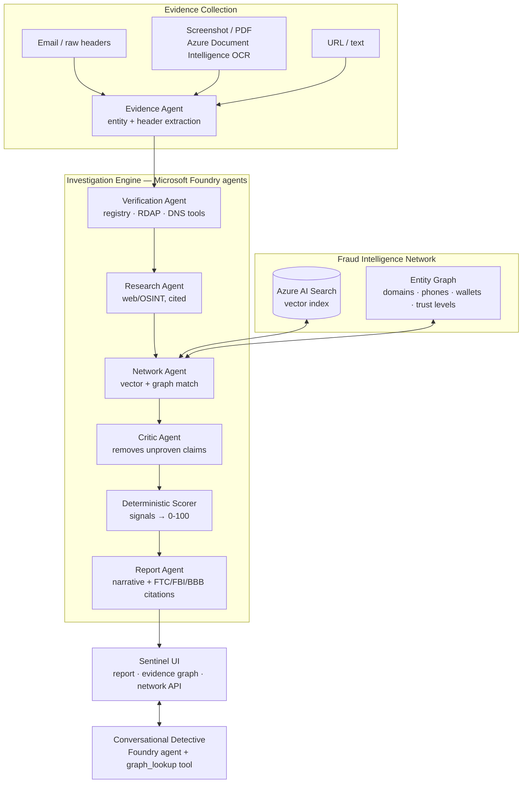

# Architecture

Verify My Interview is a fraud-intelligence platform: four cooperating systems
that collect evidence, investigate it with specialist Microsoft Foundry agents,
match it against a scam-intelligence graph, and let the user interrogate the
result.

## The six agents

Each stage is a named specialist with its own trace entry (engine, summary,
findings, duration). Foundry (`@azure/ai-agents`, Entra ID auth) drives the
reasoning stages when `AZURE_AI_PROJECT_ENDPOINT` is configured; every agent
also has a deterministic fallback, so the pipeline always completes.

| Stage | Agent | File | What it does |
|---|---|---|---|
| 1 | Evidence | `src/backend/agent/agents/evidenceAgent.ts` | Classifies the input, extracts entities (companies, emails, domains, URLs, phones, money requests) and parses raw email headers: Reply-To mismatch, sender IP, SPF/DKIM/DMARC results |
| 2 | Verification | `src/backend/agent/agents/investigatorAgent.ts` | Plans and calls verification tools — company registry (OpenCorporates), domain RDAP/WHOIS, DNS/MX, scam-pattern scan |
| 3 | Research | `src/backend/agent/agents/researchAgent.ts` | Independent web/OSINT evidence via SerpAPI: official careers listings, scam/fraud mentions — every finding carries source links |
| 4 | Network | `src/backend/agent/agents/networkAgent.ts` | Semantic match against the Azure AI Search report corpus plus STRUCTURAL match against the entity graph (shared domains/emails/phones/payment handles) |
| 5 | Critic | `src/backend/agent/agents/verifierAgent.ts` | Adversarial review — strikes any claim no successful tool result supports, adjusts confidence |
| 6 | Report | `src/backend/agent/agents/reporterAgent.ts` | Composes the narrative verdict and recommended next steps from vetted findings |

The orchestrator (`src/backend/agent/orchestrator.ts`) wires the stages and
returns the report, the full pipeline trace, the structured signals, network
matches, and the case subgraph in one response.

## Proof discipline

Agents gather and vet evidence; **they never set the score**.

- Every pipeline finding is `claim + evidence + confidence + source`
  (`Finding` in `src/types/report.ts`).
- The signal engine (`src/backend/scorer/signalEngine.ts`) converts raw tool
  results into `StructuredSignal`s — each carries its proof (`source` +
  `detail`) and a signed point value.
- The deterministic scorer (`src/backend/scorer/deterministic_scorer.ts`) sums
  signal points into a 0–100 score; the mapping to a risk level is fixed and
  inspectable. A case with zero signals and no verifiable identifiers reports
  `Inconclusive`, never a reassuring "Low Risk".
- The knowledge layer (`src/backend/knowledge/guidance.ts` +
  `src/data/guidance.json`) attaches official FTC / FBI IC3 / BBB guidance
  matched to the signals the case actually triggered, with real source URLs.

## Fraud Intelligence Network

`src/backend/network/`

- **Report corpus** — Azure AI Search index (`scam-reports-v2`) with a
  1536-dim HNSW vector field for semantic matching; seeded synthetic reports
  (`seedData.ts`) when Azure is unconfigured.
- **Entity graph** (`entityGraph.ts`) — built deterministically from the
  corpus. Nodes are reports plus HARD identifiers: domains, emails, phones,
  payment handles. Company names and recruiter aliases get `impersonates` /
  `alias_of` edges only and **never merge entities** — scammers rotate brands
  but reuse infrastructure. Payment-handle matching extracts identifier-shaped
  tokens (wallet addresses, Zelle/CashApp tags) and exact-matches them; brand
  or method words never link cases.
- **Trust levels** — `unverified → verified → corroborated → trusted`.
  Reports sharing a hard identifier are promoted to `corroborated`
  automatically; authoritative-sourced entries are `trusted`. Network signals
  are trust-weighted (a lone unverified report scores 6 points; corroborated
  infrastructure scores 24+), which is the database-poisoning defense.
- **API** — `GET /network/graph` (full graph, filterable), `GET /network/stats`
  (trends, top domains/handles, trust counts); the `/analyze` response includes
  the case-centric subgraph that powers the clickable evidence graph in the UI.

## Reliability and safety

- **Engine modes** — `foundry`, `deterministic`, or `mixed`, reported per stage
  in the trace and in the UI. Unset the Azure env vars and the same case still
  completes end-to-end (the demo-insurance run).
- **Evals** — `npm run eval` runs every scenario in `tests/test_cases/`
  through the full pipeline in scrubbed offline mode and asserts risk-level
  band, score range, required/forbidden signals, and network-match
  expectations. `npm test` gates the same suite via Jest.
- **Health** — `GET /health` reports per-subsystem flags (foundry_agents,
  scam_network_index, entity_graph, document_ocr, voice_transcription,
  web_research).
- **Safety framing** — risk assessment, not accusation; evidence is untrusted
  input; network demo data is synthetic and labeled as such in the UI; no PII
  is logged.

## Azure services

| Service | Use | Degrades to |
|---|---|---|
| Microsoft Foundry Agent Service | All six reasoning stages + conversational detective (Entra ID auth, no API keys) | Deterministic per-agent fallbacks |
| Azure AI Search | Vector + filterable index over the report corpus | In-memory seed corpus |
| Azure AI Document Intelligence | OCR for screenshots / PDF offer letters | Text-only intake |
| Azure OpenAI | `text-embedding-3-small` vectors for semantic match | Entity/structural matching only |

## Frontend

React 18 + Vite + Tailwind (Sentinel design system — dark security-SaaS, no
emojis, Space Grotesk/Inter/JetBrains Mono). Pages: Verify
(paste / OCR upload / URL / voice) and Report (verdict, six-stage timeline,
findings, guidance citations, evidence graph, detective chat). The intelligence
network is exposed through `GET /network/graph` and `GET /network/stats` and
is rendered inside the report dossier. The evidence graph is
`react-force-graph-2d` with node color by type, size by report count, and trust
rings.
