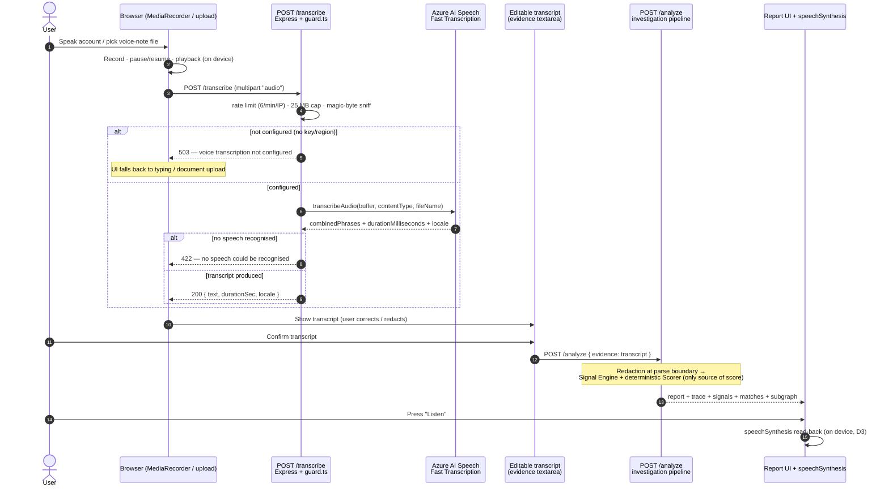

# Voice Investigation — "Tell Us What Happened"

The third evidence channel. A user speaks their account of a suspected job
scam; Azure AI Speech turns it into a transcript; the transcript flows into the
**same** deterministic investigation pipeline as pasted text and OCR'd
documents. No separate scoring path, ever.

> Status legend (matches `docs/PRODUCTION_READINESS.md`): **[done]** shipped in
> this build · **[next]** the first production sprint · **[later]** roadmap.

This document is **authoritative**: it records what actually shipped, the
deliberate design decisions behind it (sourced from
`.claude/orchestrator/PROJECT_STATE.md`), and the roadmap — so judges and future
engineers can tell reality from aspiration. Where the original draft design and
the shipped reality conflict, the shipped reality and the recorded decisions win;
the superseded ideas are preserved in §10 ("Decisions & deviations") and the
roadmap rather than deleted.

---

## 1. Overview & business objective

Many scam victims have **no digital evidence left**. In the South African
context the scam frequently runs over **WhatsApp calls and voice notes**: there
is no forwardable email, the chat thread was deleted, no screenshots were taken —
but the person can still tell the story. Pasting text and uploading screenshots
both assume the victim *kept* something. Voice assumes nothing but a phone and a
willingness to talk.

Voice is therefore the **lowest-barrier evidence channel**, and it serves three
goals at once:

- **Reach** — spoken reporting meets victims where the scam actually happened
  (a voice call / voice note), not at a keyboard.
- **South-African fit** — en-ZA is the first candidate locale, ahead of en-US /
  en-GB, so local accents and phrasing transcribe well by default.
- **Accessibility & low-literacy** — speaking, and an audio read-back of the
  verdict, lower the barrier for users who find typing or reading dense reports
  hard.

Speech becomes a transcript; the transcript becomes entities, signals, graph
leads, and a scored report — through the identical pipeline that serves typed
and uploaded evidence. The barrier to *reporting* a scam drops to "press record
and explain what happened", while the **rigour of the assessment is unchanged**:
the same deterministic Signal Engine and Risk Scorer remain the only source of
any score (`CLAUDE.md` §1; `docs/ARCHITECTURE.md`, "Proof discipline"). Voice
changes the *input channel*, never the scoring.

---

## 2. User journey (MVP)

**Primary flow — narrate a case**

1. **Record.** On the New Case screen the user picks the "Tell Us What Happened"
   tab and presses record. The browser captures audio with `MediaRecorder`
   (WebM/Opus by default).
2. **Pause / resume / playback.** Recording can be paused and resumed — victims
   gather their thoughts; the account is rarely linear — and the captured clip
   can be played back before anything leaves the browser.
3. **Transcribe.** The audio blob is posted to `POST /transcribe`. Azure AI
   Speech Fast Transcription returns the text.
4. **Review / edit — human-in-the-loop (the important step).** The transcript is
   shown in the **editable evidence textarea** *before* any analysis. Speech
   recognition is imperfect (names, domains, rand amounts); the user corrects
   it, and — equally — gets a clear moment to remove anything they did not mean
   to include. **Nothing is analysed until the user confirms the transcript.**
5. **Open the investigation.** On confirm, the edited transcript is submitted to
   `POST /analyze` exactly as if it had been typed. The full report, six-stage
   trace, signals, network matches, and evidence subgraph come back.

**Secondary flow — upload a voice note.** Instead of recording live, the user can
upload an existing audio file (a saved WhatsApp voice note, a phone memo). It
hits the same `POST /transcribe` → review/edit → `POST /analyze` path. Supported
container formats are WAV, MP3, M4A, OGG, FLAC, WebM, and AMR (AMR being common
for mobile voice notes).

**Report read-back.** On the Report screen the verdict and recommended next
steps can be read aloud using the browser's `speechSynthesis` API — an
accessibility and low-literacy affordance. Per decision **D3**, this is
device-local: **no audio of the user's case ever leaves the device** for
read-back.

The contract the frontend depends on is small and stable
(`frontend/src/lib/api.ts`): `transcribeAudio(blob, fileName)` posts a
`FormData` field named `audio` to `POST /transcribe` and resolves to
`{ text, durationSec, locale }`. The editable transcript is then sent through the
existing `analyze(evidence)` call. The intake channel is an *input adapter*; the
pipeline never learns whether the evidence was spoken, pasted, or OCR'd.

---

## 3. Architecture

Voice is additive. It introduces one new endpoint (`/transcribe`) in front of the
unchanged investigation pipeline; everything downstream of the editable
transcript is the existing system.

### 3.1 End-to-end sequence



### 3.2 What is an Azure service vs local deterministic code

| Component | Where it runs | Nature |
| --- | --- | --- |
| `MediaRecorder`, audio playback, editable transcript, `speechSynthesis` read-back | Browser | Client-side; no server, no Azure |
| `POST /transcribe` rate limit + magic-byte sniff + size cap | Local Express (`http/guard.ts`) | Deterministic, no external call |
| Fast Transcription | **Azure AI Speech** (Cognitive Services REST) | External, **key-gated** |
| Entity extraction + **redaction at the parse boundary** | Local (Evidence Agent + `privacy/redaction.ts`) | Deterministic |
| Verification / Research / Network reasoning | **Microsoft Foundry** agents (each with a deterministic fallback) | External-when-configured |
| Signal Engine + Risk Scorer | Local (`scorer/`) | **Deterministic — the only source of the score** |
| Report narrative + guidance citations | Foundry Report Agent (deterministic fallback) | External-when-configured |

The redaction boundary sits where free text first becomes structured evidence,
so a transcript is sanitised on exactly the same path as pasted text — SA ID
numbers, bank- and card-numbers stripped, scam IOCs (emails, domains, phones,
payment handles) kept (`docs/PRIVACY.md` §3).

### 3.3 The transcription call

`transcribeAudio()` (`src/backend/speech/speechToText.ts`) calls the Fast
Transcription REST endpoint

```
https://{AZURE_SPEECH_REGION}.api.cognitive.microsoft.com/speechtotext/transcriptions:transcribe?api-version=2024-11-15
```

as `multipart/form-data` with two parts: the `audio` part (the raw buffer) and a
JSON `definition` part `{ locales, profanityFilterMode: 'None' }`. Candidate
`locales` default to `en-ZA,en-US,en-GB` and are overridable via
`AZURE_SPEECH_LOCALES`; Azure auto-selects the best match. The function reads
`combinedPhrases[].text` (falling back to `phrases[].text`), `durationMilliseconds`,
and the recognised `locale`, returning `{ text, durationSec, locale }`. It
**throws** on transport/credential errors so the route returns a clean `500` and
never surfaces partial or garbage text silently. `speechEnabled()` gates the
whole capability on `AZURE_SPEECH_KEY` + `AZURE_SPEECH_REGION`.

---

## 4. API contract — `POST /transcribe`

Route: `src/backend/server.ts`. Middleware order is
`rateLimit({ name: 'transcribe', windowMs: 60_000, max: 6 })` →
`audioUpload.single('audio')` (multer memory storage, 25 MB cap) → handler.

**Request.** `multipart/form-data` with a single field `audio` (the recording or
uploaded voice note). No JSON body. The client's declared MIME type is ignored.

**Response (200).** `{ "text": string, "durationSec": number, "locale": string }`.

| Status | When | Body | Notes |
| --- | --- | --- | --- |
| **200** | Speech recognised | `{ text, durationSec, locale }` | `text` is the transcript; `durationSec` is rounded from `durationMilliseconds`; `locale` is Azure's recognised locale (or the first candidate) |
| **400** | No `audio` field in the request | `{ error: "audio file is required" }` | Checked before anything else in the handler |
| **413** | Upload exceeds the 25 MB cap | `{ error: "File too large (25 MB limit)." }` | Raised by multer (`LIMIT_FILE_SIZE`); the shared error handler reports the per-route cap (25 MB for `/transcribe`, 8 MB for `/upload`). Other multipart errors (wrong/extra field) return **400** `{ error: "Upload rejected." }` |
| **415** | Magic-byte sniff rejects the buffer (not real WAV/MP3/M4A/OGG/FLAC/WebM/AMR) | `{ error: "Unsupported audio format. Record or upload WAV, MP3, M4A, OGG, FLAC, WebM, or AMR." }` | Runs **before** the `speechEnabled()` check, so a disguised payload is rejected even when Speech is unconfigured |
| **422** | Azure returned no recognisable speech (silence/noise) | `{ error: "No speech could be recognised. Try recording again in a quieter setting." }` | Triggered when the transcript text is empty after trimming |
| **429** | Over the per-IP rate limit (>6/min) | rate-limit error + `Retry-After` header | From the shared `rateLimit` middleware |
| **503** | Speech subsystem not configured (`speechEnabled()` false) | `{ error: "Voice transcription is not configured" }` | Graceful degradation — the rest of the app is unaffected; UI falls back to typing/upload |
| **500** | Upstream Azure / transport error | `{ error: "Transcription failed" }` | `transcribeAudio()` threw; no partial text is ever returned |

`GET /health` reports the subsystem under `capabilities.voice_transcription`
(value = `speechEnabled()`), alongside `document_ocr`, `web_research`, etc.

---

## 5. Evidence-channel parity

All three intake channels converge on `POST /analyze`. The deterministic scorer
is the single source of truth; **no agent — and no transcription — ever sets a
score**.

| | Voice | Pasted text | Document OCR |
| --- | --- | --- | --- |
| Intake endpoint | `POST /transcribe` | (none — typed in UI) | `POST /upload` |
| Azure service used at intake | AI Speech (Fast Transcription) | — | AI Document Intelligence |
| Produces | editable transcript | text | extracted text |
| Human-in-the-loop before analysis | **yes** (review/edit transcript) | yes (the user typed it) | yes (extracted text is shown/editable) |
| Analysis endpoint | `POST /analyze` | `POST /analyze` | `POST /analyze` |
| Redaction boundary | Evidence Agent (`redaction.ts`) | same | same |
| Scoring | deterministic Signal Engine + Scorer | same | same |

The intake channel is an **input adapter**, not a code path that branches the
investigation. By the time evidence reaches `/analyze` it is plain text; the
pipeline cannot tell — and must not care — whether it was spoken, pasted, or
OCR'd.

---

## 6. Security & abuse resistance

Voice inherits the platform's untrusted-input posture (`CLAUDE.md` §5;
`docs/PRODUCTION_READINESS.md` §2) and adds the audio-specific controls:

- **Client MIME is never trusted.** The declared `Content-Type` is ignored;
  `sniffAudioType()` (`http/guard.ts`) inspects magic bytes and accepts only
  genuine WAV / MP3 / M4A / OGG / FLAC / WebM / AMR. A disguised payload (HTML,
  an executable, a zip) is rejected with **415** before it can reach Azure
  Speech. This check runs *before* the configuration check, so it holds even
  when Speech is switched off.
- **Size cap.** The audio upload (`audioUpload`, multer memory storage) is capped
  at **25 MB**; an oversized upload is rejected with **413** (see §4 for the
  shared-handler message caveat).
- **Per-IP rate limit.** `POST /transcribe` is limited to **6 requests/minute/IP**
  (`rateLimit({ name: 'transcribe', windowMs: 60_000, max: 6 })`); over-limit
  callers get **429** with a `Retry-After`. The limit is tighter than `/analyze`
  (10/min) because transcription is the most expensive external call.
- **Key-gating + health flag + graceful 503.** The whole capability is gated on
  `AZURE_SPEECH_REGION` + `AZURE_SPEECH_KEY`; unconfigured, `/transcribe` returns
  **503** and `GET /health` reports `voice_transcription: false`. The
  deterministic investigation pipeline is always available regardless.
- **The transcript is untrusted evidence.** Once transcribed, the text gets no
  more trust than pasted text: it is redacted at the parse boundary and the
  agents are instructed to treat embedded instructions as data, not commands
  (the indirect prompt-injection posture in `docs/PRODUCTION_READINESS.md` §2).
- **Content-free audit log.** `auditLog` records method, path, status, latency,
  and a salted IP hash — never the audio, the transcript, or query strings
  (`http/guard.ts`).
- **No audio persistence.** See §7 — the buffer is processed in memory and
  discarded; there is no audio at rest to exfiltrate.

---

## 7. POPIA & privacy by design

A voice recording **is personal information** (POPIA), and very likely carries
the data subject's own voice plus the names/numbers of third parties they
mention. The design treats it accordingly.

**Decision D2 — the MVP does NOT retain raw audio.** The audio buffer is held in
memory only for the duration of the transcription request (multer memory
storage; no disk write, no store) and then discarded when the request ends. The
**transcript** becomes the evidence record, and it passes through the **existing
redaction boundary** (`src/backend/privacy/redaction.ts`) — SA ID numbers, bank-
and card-numbers are stripped, while scam IOCs are kept because they *are* the
evidence (`docs/PRIVACY.md` §3). This is the same minimality (POPIA s10 / s12)
the rest of the platform already enforces, extended to a new modality, and it is
consistent with the platform's "process, then discard" retention stance for raw
evidence (`docs/PRIVACY.md` §5).

The product owner's original draft idea — **retain raw audio for future
re-analysis** (e.g. re-running an improved recogniser, or speaker analysis) — is
deliberately a **roadmap item, not the MVP**. Retaining a voice recording raises
the stakes: it is richer personal information than a transcript, and POPIA would
require an **explicit-consent UX** (`docs/PRIVACY.md` §1, s11(1)(a)) and a
**defined retention schedule** (`docs/PRIVACY.md` §5, s14) we do not yet have.
It is therefore gated behind **[later] opt-in consent + retention policy** rather
than shipped by default. This is a conscious deviation from the user's draft
design, by design (see §10).

**Report read-back stays on-device (D3).** The verdict is read aloud with the
browser's `speechSynthesis`. No synthesis request — and so no audio or text of
the user's case — leaves the device. Azure Neural TTS would give
production-quality, SA-accented narration but would mean sending case text to a
cloud TTS service; it is a **[next]** roadmap item, evaluated against the same
cross-border data-residency questions as the rest of the stack
(`docs/PRIVACY.md` §8).

---

## 8. Implementation status — what shipped, and where it lives

Each shipped piece is mapped to its real source location. Items marked
**[next]/[later]** have no code yet and are tracked in §9.

| Capability | Status | Source of truth |
| --- | --- | --- |
| `speechEnabled()` key-gate (`AZURE_SPEECH_KEY` + `AZURE_SPEECH_REGION`) | **[done]** | `src/backend/speech/speechToText.ts` |
| `transcribeAudio()` — Azure Fast Transcription REST (`api-version=2024-11-15`), en-ZA-first locales, `profanityFilterMode: 'None'` | **[done]** | `src/backend/speech/speechToText.ts` |
| `POST /transcribe` route — 400/415/422/503/500 handling, returns `{ text, durationSec, locale }` | **[done]** | `src/backend/server.ts` |
| Rate limit 6/min/IP on `/transcribe` | **[done]** | `src/backend/server.ts` (route) + `rateLimit` in `src/backend/http/guard.ts` |
| 25 MB audio cap (`audioUpload`, multer memory storage) + 413 on overflow | **[done]** | `src/backend/server.ts` (multer config + shared error handler) |
| Magic-byte sniffing (WAV/MP3/M4A/OGG/FLAC/WebM/AMR) | **[done]** | `sniffAudioType()` in `src/backend/http/guard.ts` |
| Health flag `capabilities.voice_transcription` | **[done]** | `src/backend/server.ts` (`GET /health`) |
| No raw-audio persistence (in-memory buffer, discarded) | **[done]** | `src/backend/server.ts` (memory storage; no write path) |
| Transcript redaction at the parse boundary | **[done]** (reused) | `src/backend/privacy/redaction.ts` via the Evidence Agent |
| Env-var names documented | **[done]** | `.env.example` (`AZURE_SPEECH_REGION`, `AZURE_SPEECH_KEY`, `AZURE_SPEECH_LOCALES`) |
| Client transcription helper `transcribeAudio(blob, fileName)` → `{ text, durationSec, locale }` | **[done]** | `frontend/src/lib/api.ts` |
| Voice recorder UI + "Tell Us What Happened" tab + transcript review | **[done]** (built in parallel) | `frontend/src/components/VoiceRecorder.tsx`, `frontend/src/pages/NewCase.tsx` |
| `speechSynthesis` report read-back ("Listen") | **[done]** (built in parallel) | Report page (frontend) |
| `AZURE_SPEECH_*` scrubbed during offline evals | **[next]** | `SCRUBBED_ENV` in `src/backend/scripts/runEvals.ts` (add per `CLAUDE.md` §3) |
| Unit test for `sniffAudioType` positive/negative buffers | **[next]** | `tests/unit/guard.test.ts` (model on the existing `sniffUploadType` suite) |
| Synthetic "voice narration" eval fixture | **[next]** | `tests/test_cases/` |
| Fix 413 message to reflect the 25 MB audio cap | **[next]** | `src/backend/server.ts` shared error handler |

> Note: the offline eval harness needs **no audio** — a transcript is just text,
> so a synthetic spoken-account fixture exercises the full `/analyze` path and
> keeps evals deterministic (`CLAUDE.md` §3). Adding `AZURE_SPEECH_*` to
> `SCRUBBED_ENV` guarantees the transcription call is never made during evals.

---

## 9. Roadmap

| Capability | Status | Notes |
| --- | --- | --- |
| Conversational voice follow-up | **[next]** | A voice input/output skin over the existing text `/chat` detective — the user asks/answers by voice; **no new reasoning path**, no new scorer |
| Azure Neural TTS report read-back | **[next]** | Production-quality, SA-accented narration; cloud TTS — weigh cross-border data residency (`docs/PRIVACY.md` §8) against the on-device default (D3) |
| Speaker diarization for call recordings | **[later]** | "Who said what" in a recorded WhatsApp/phone call, so the recruiter's turns can be separated from the victim's |
| Opt-in consented audio retention for re-analysis | **[later]** | The draft's "retain raw audio" idea, gated behind explicit consent + a defined retention schedule (D2; `docs/PRIVACY.md` §1 s11(1)(a), §5 s14) |
| WhatsApp voice-note ingestion via a bot | **[later]** | Forward a voice note to the bot, get a report — the real distribution vehicle (`docs/PRODUCTION_READINESS.md` §6) |
| Multilingual SA locales | **[later]** | af-ZA, zu-ZA (and xh-ZA, …) as Azure Speech supports them; add to `AZURE_SPEECH_LOCALES` |

---

## 10. Decisions & deviations from the original draft

The shipped MVP follows the binding decisions in
`.claude/orchestrator/PROJECT_STATE.md`. Two of them are deliberate deviations
from the product owner's original draft design; they are recorded here rather
than silently dropped.

- **D1 — Voice is a third evidence channel into the same pipeline.**
  `/transcribe` (Azure Speech, key-gated) → editable transcript → `/analyze`.
  The deterministic scorer remains the only source of risk scores. *(Confirms,
  not deviates from, the draft.)*
- **D2 — Raw audio is NOT retained in the MVP (deviation).** The draft wanted to
  retain raw audio for future re-analysis. POPIA minimality (s10/s12), the lack
  of a consent UX (s11(1)(a)), and the lack of a retention schedule (s14) make
  default retention premature. **Resolution:** the MVP processes the audio buffer
  in memory and discards it; only the redacted transcript persists. Audio
  retention moves to the roadmap behind explicit opt-in consent + a retention
  policy (§9).
- **D3 — Report read-back is browser `speechSynthesis`, not Azure TTS now
  (deviation in timing).** A device-local read-back keeps all case audio/text on
  the user's device (no cloud TTS call, no cross-border transfer) and ships for
  free today. **Resolution:** Azure Neural TTS (production-quality, SA-accented)
  is a `[next]` roadmap item, weighed against `docs/PRIVACY.md` §8.

Other draft details that the shipped reality clarified rather than reversed:

- The draft's flowchart is replaced by an end-to-end **sequence diagram** (§3.1)
  plus a dedicated **API contract table** (§4), to make the request lifecycle and
  every status code explicit.
- The draft implied a 25 MB-specific 413 message; the shared multer error
  handler now reports the per-route cap (25 MB for `/transcribe`, 8 MB for
  `/upload`), so the contract table in §4 is exact.

---

See also: [`docs/ARCHITECTURE.md`](ARCHITECTURE.md) ·
[`docs/PRIVACY.md`](PRIVACY.md) ·
[`docs/PRODUCTION_READINESS.md`](PRODUCTION_READINESS.md)
